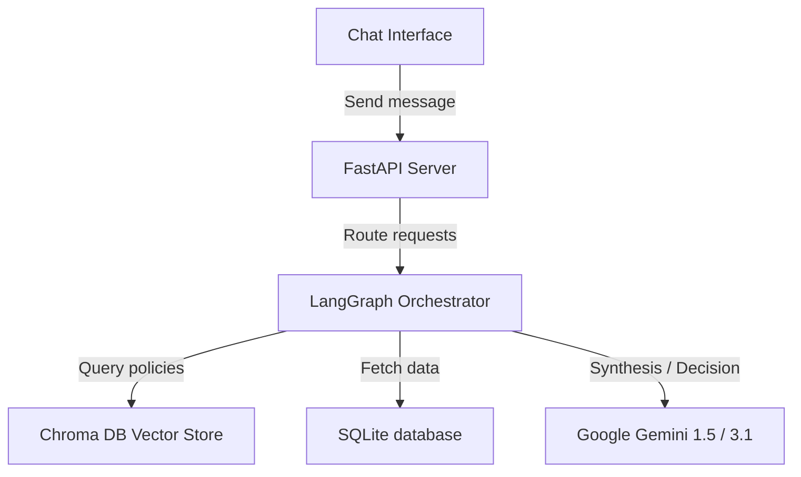
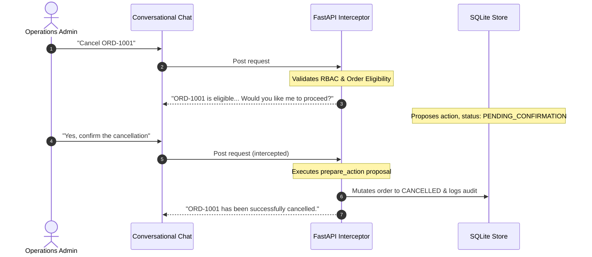

# ParcelPilot AI Support Agent

ParcelPilot is a production-quality AI customer support agent built to serve a B2B logistics platform. The platform handles account queries, orders, tracking, support tickets, and business-critical entitlements like cancellation fees and service credits.

This repository implements a multi-step reasoning AI agent powered by LangGraph, grounded by metadata-aware retrieval, structured SQL queries, and strict role-based access control (RBAC).

---

## Architecture Overview

ParcelPilot is designed as a single, containerized production deployment. It combines:
1. **Frontend (React / Vite)**: A clean, chat-only conversational interface.
2. **Backend (FastAPI)**: Serves static compiled frontend assets and exposes the `/api/*` conversational endpoints.
3. **Agent Brain (LangGraph)**: Multi-step reasoning loops integrating vector store search and structured database lookups.
4. **Data Layer (SQLite & Chroma DB)**: Stores orders/tickets and policy document embedding chunks.



---

## Features

- **Pure Chat Interface**: Completely simplified, user-facing UI hiding internal logs, tool activity panels, citations, and action IDs for all roles.
- **Entitlement Calculations**: Deterministic checks for order cancellation eligibility, delay compensation service credits, and SLA response breaches.
- **Robust Role-Based Access Control (RBAC)**: Enforces access restrictions at both graph and database layers.
- **Action Confirmation Architecture**: Safely prepares mutations conversationally, requiring a conversational confirmation step before committing SQLite updates.
- **Resilient Orchestration**: Preserves tool calls when the LLM sets `"should_continue": false` simultaneously.

---

## Local Setup

### 1. Place Source Files
Before running the system, place the source files into the appropriate directories:
- Place the 6 PDFs into `data/source/documents/`
- Place the excel sheet `ParcelPilot_Assessment_Data.xlsx` into `data/source/`

### 2. Configure Environment Variables
Copy `.env.example` to `.env` and configure your API keys:
```bash
cp .env.example .env
```

### 3. Run Ingestion Pipeline
To seed SQLite tables and build Chroma vector indexes:
```bash
python scripts/initialize.py
```

### 4. Run Backend & Frontend in Development Mode
- **Backend (Port 8000)**:
  ```bash
  PYTHONPATH=. .venv/bin/uvicorn backend.app.main:app --reload --port 8000
  ```
- **Frontend (Port 5173)**:
  ```bash
  cd frontend
  npm install
  npm run dev
  ```

---

## Environment Variables

| Variable | Description | Production Value |
| :--- | :--- | :--- |
| `GEMINI_API_KEY` | Google AI Studio API key | (Your Secret Key) |
| `LLM_MODE` | API provider to use | `gemini` (or `mock` for tests) |
| `LLM_MODEL` | AI model to invoke | `gemini-3.1-flash-lite` |
| `DATABASE_PATH` | Path to persistent SQLite file | `/data/parcelpilot.db` |
| `VECTORSTORE_PATH`| Path to Chroma DB files | `/app/data/vectorstore` |

---

## How the Cancellation Confirmation Flow Works



1. **Request**: The user asks to cancel an order (e.g. *"Cancel ORD-1001"*).
2. **Eligibility check**: The agent checks permissions and evaluates entitlement rules. If eligible, it calls `prepare_action` which registers an action proposal marked as `PENDING_CONFIRMATION` in SQLite.
3. **Confirmation request**: The agent responds conversationally asking the user if they want to proceed.
4. **Execution**: The user replies conversationally (e.g. *"Yes, confirm"*). The `/api/chat` interceptor detects the confirmation phrase, retrieves the pending proposal, validates permissions, mutates the order status to `CANCELLED` in SQLite, writes a audit log entry, and replies with a clean confirmation.

---

## Deployment Instructions (Option B - Single Docker)

### 1. Build and Run locally with Docker
To build the production container locally and run it:
```bash
docker build -t parcel-pilot .
docker run -p 8000:8000 \
  -e GEMINI_API_KEY="your-api-key" \
  -e LLM_MODE="gemini" \
  -e LLM_MODEL="gemini-3.1-flash-lite" \
  parcel-pilot
```

### 2. Deploy to Production Platforms (Render, Railway, or Fly.io)
1. **Source Control**: Push this repository to GitHub/GitLab.
2. **Create Web Service**: Select Docker deployment/Dockerfile option on your provider console.
3. **Configure Volumes**: Mount a persistent volume at `/data` inside the container.
4. **Environment Configuration**: Set environment variables:
   - `GEMINI_API_KEY`: *(Your Secret Key)*
   - `LLM_MODE`: `gemini`
   - `LLM_MODEL`: `gemini-3.1-flash-lite`
   - `DATABASE_PATH`: `/data/parcelpilot.db`
   - `VECTORSTORE_PATH`: `/app/data/vectorstore/chroma`
5. **Initial Seeding**: Run `/app/scripts/initialize.py` inside the container terminal once to populate database tables and index documents if needed.
